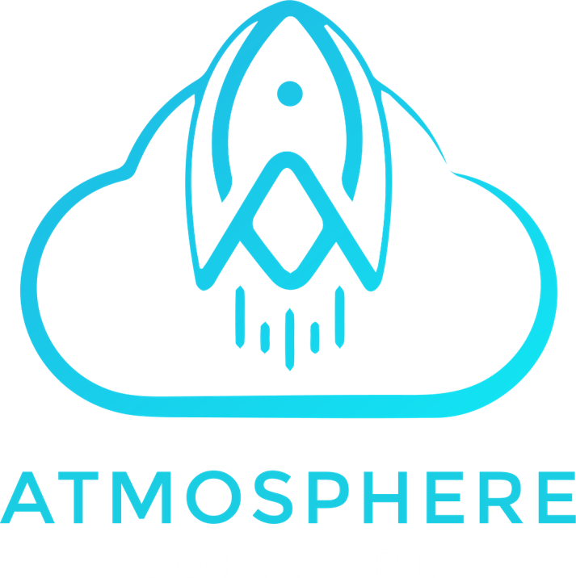

# 

# AtmoDrive API
Through this project, the Hero application and the passenger application can reach the end point with the backend

# Getting started

## Installation

Clone the repository

    git clone git@github.com:AtmoDrive/AtmoDrive-api.git

Switch to the repo folder

    cd AtmoDrive-api

Install all the dependencies using composer

    composer install

Copy the example env file and make the required configuration changes in the .env file

    cp .env.example .env

Generate a new application key

    php artisan key:generate

Generate a new JWT authentication secret key

    php artisan jwt:generate

Start the local development server

    php artisan serve

You can now access the server at http://localhost:8000

**TL;DR command list**

    git clone git@github.com:AtmoDrive/AtmoDrive-api.git
    cd AtmoDrive-api
    composer install
    cp .env.example .env
    php artisan key:generate
    php artisan jwt:generate 
    
**Make sure you set the correct database connection information before running the migrations** [Environment variables](#environment-variables)

    php artisan serve

----------

# Code overview

## Folders

- `app` - Contains all the Eloquent models
- `app/Http/Controllers/Api` - Contains all the api controllers
- `app/Http/Middleware` - Contains the JWT auth middleware
- `app/Http/Requests/Api` - Contains all the api form requests
- `config` - Contains all the application configuration files
- `routes` - Contains all the api routes defined in api.php file

## Environment variables

- `.env` - Environment variables can be set in this file

***Note*** : You can quickly set the database information and other variables in this file and have the application fully working.

----------

# Testing API

Run the laravel development server

    php artisan serve

The api can now be accessed at

    http://localhost:8000/api

Request headers

| **Required** 	| **Key**              	| **Value**            	|
|----------	|------------------	|------------------	|
| Yes      	| Content-Type     	| application/json 	|
| Yes      	| X-Requested-With 	| XMLHttpRequest   	|
| Yes 	| Authorization    	| Token {JWT}      	|
